# Mindburn Labs Organization Repository (`.github`)

> [!NOTE]
> **Internal Developer Hub**: This is the core configuration and default workflows repository for the **Mindburn Labs** organization. It governs organization-wide defaults, default security policies, devcontainer configurations, and acts as the central technical source-of-truth mapping our sovereign polyrepo architecture.

---

## 1. System Overview & Architecture

Mindburn Labs is engineered for high-integrity, deterministic execution across all layers. The entire ecosystem consists of 66 repositories divided into structured operational layers.

Below is the definitive target ecosystem architecture diagram mapping all 66 repositories and showing how the Agent Substrate, SDKs, and Decoupled frontends are interconnected:

### Target Ecosystem Diagram (A4 Format)

```mermaid
graph TD
    %% Styling and Color Palette (Harmonious Sleek Palette)
    classDef ui fill:#1e1b4b,stroke:#818cf8,stroke-width:2px,color:#f8fafc;
    classDef contr fill:#2e1509,stroke:#fb923c,stroke-width:2px,color:#f8fafc;
    classDef prod fill:#064e3b,stroke:#059669,stroke-width:2px,color:#f8fafc;
    classDef platform fill:#0f172a,stroke:#64748b,stroke-width:2px,color:#f8fafc;
    classDef substrate fill:#3b0764,stroke:#d8b4fe,stroke-width:2px,color:#f8fafc;
    classDef sdk fill:#111827,stroke:#38bdf8,stroke-width:2px,color:#f8fafc;
    classDef ml fill:#31102f,stroke:#f472b6,stroke-width:2px,color:#f8fafc;

    %% 1. Platform & Devops Layer
    subgraph Platform_Layer["1. Platform DevOps (platform-* / homebrew-*)"]
        P1["platform-actions<br>(CI Templates)"]:::platform
        P2["platform-templates<br>(Golden Paths)"]:::platform
        P3["platform-policies<br>(OPA / Kyverno)"]:::platform
        P4["platform-observability<br>(OTel Dashboards)"]:::platform
        P5["platform-terraform-modules<br>(IaC Modules)"]:::platform
        H_Tap["homebrew-tap<br>(CLI Distribution)"]:::platform
        G_Dot[".github<br>(Org Workflow Defaults)"]:::platform
    end

    %% 2. Agent Substrate Layer
    subgraph Substrate_Layer["2. Agent Substrate & Automation Layer"]
        SU1["platform-agent-substrate<br>(Supervisor Core)"]:::substrate
        SU2["platform-agent-capabilities<br>(Capabilities Registry)"]:::substrate
        SU3["platform-mcp-registry<br>(Tool Registration Index)"]:::substrate
        SU4["svc-agent-control-plane<br>(Agent Policy & Routing)"]:::substrate
        SU5["svc-agent-sandbox-runner<br>(Enclave Orchestrator)"]:::substrate
        SU6["integration-agent-evals<br>(Agent Regression Testing)"]:::substrate
    end

    %% 3. Infrastructure & GitOps Layer
    subgraph Infra_Layer["3. Infrastructure & GitOps (infra-* / gitops-*)"]
        I1["infra-live<br>(Env Configurations)"]:::platform
        I2["infra-networking<br>(Subnets & Mesh Routing)"]:::platform
        I3["infra-clusters<br>(Kubernetes Blueprints)"]:::platform
        G1["gitops-apps<br>(Argo CD Application States)"]:::platform
        G2["gitops-platform<br>(Argo CD Core Controllers)"]:::platform
    end

    %% 4. Contract, Integration & SDKs
    subgraph Contracts_Layer["4. Contracts, Integrations & SDKs"]
        subgraph Catalogs["Catalogs & Testing"]
            C1["contracts-api-catalog<br>(OpenAPI REST Specs)"]:::contr
            C2["contracts-event-catalog<br>(AsyncAPI NATS Schemas)"]:::contr
            C3["contracts-proto<br>(Central Buf Registry)"]:::contr
            C4["contracts-schema-catalog<br>(Offline Static Schemas)"]:::contr
            INT1["integration-mindburn-platform<br>(Global Release Lockfile)"]:::contr
            INT2["integration-helm<br>(HELM Integration Tests)"]:::contr
            INT3["integration-titan<br>(Titan Integration Tests)"]:::contr
            INT4["integration-pilot<br>(Pilot Integration Tests)"]:::contr
            INT5["integration-ai-flows<br>(Agent Prompt Flow Testing)"]:::contr
        end
        subgraph SDKs["Client SDK Packages (pkg-*)"]
            SDK_G["pkg-helm-client-go<br>(Go SDK stub)"]:::sdk
            SDK_P["pkg-helm-client-python<br>(Python SDK stub)"]:::sdk
            SDK_T["pkg-helm-client-ts<br>(TypeScript SDK stub)"]:::sdk
            SDK_TS["pkg-titan-shared<br>(Shared Zod Types)"]:::sdk
        end
    end

    %% 5. App & Docs Layer
    subgraph App_Layer["5. Application Interfaces & Public Docs"]
        A1["app-mindburn-web<br>(Astro Landing Site)"]:::ui
        A2["app-mindburn-admin<br>(Ops Visual Ledger)"]:::ui
        A3["app-docs-platform<br>(Onboarding Crawler)"]:::ui
        A4["app-helm-console<br>(Flutter Client)"]:::ui
        A5["docs-engineering-handbook<br>(Specs & Onboarding)"]:::ui
        A6["app-developer-portal<br>(Backstage Directory)"]:::ui
        A7["app-titan-console<br>(Algorithmic UI Console)"]:::ui
        A8["app-titan-twa<br>(Telegram MiniApp Client)"]:::ui
    end

    %% 6. Product Permanent Cores & Transition Shells
    subgraph Core_Layer["6. Permanent Cores & Transition Shells"]
        B1["helm-ai-kernel<br>(OSS Core Daemon API)"]:::prod
        B3["pilot<br>(OS Founder Core)"]:::prod
        B2["helm-ai-enterprise<br>(Enterprise Packaging Shell)"]:::platform
        B4["titan<br>(Titan Packaging & Docs Shell)"]:::platform
        B5["orggenome-compiler<br>(Archive Audit Shell)"]:::platform
    end

    %% 7. Decoupled Services & ML Models
    subgraph Decoupled_Layer["7. Decoupled Microservices, Apps & ML"]
        subgraph DecoupledSvc["Decoupled Microservices (svc-* / worker-*)"]
            S_HK["svc-helm-control-plane"]:::prod
            S_HD["svc-helm-data-plane"]:::prod
            S_HC["svc-helm-certification"]:::prod
            W_HL["worker-helm-launch-worker"]:::prod
            S_HR["svc-high-risk-loop-bridge"]:::prod

            S_TB["svc-titan-brain"]:::prod
            S_TE["svc-titan-execution"]:::prod
            W_TS["worker-titan-phase1-scavenger"]:::prod
            W_TH["worker-titan-phase2-hunter"]:::prod
            W_TN["worker-titan-phase3-sentinel"]:::prod
            S_TP["svc-titan-public-api"]:::prod
            S_TO["svc-titan-ops-api"]:::prod
            S_TV["svc-titan-vault-manager"]:::prod
            S_TS["svc-titan-signing"]:::prod
            S_TG["svc-titan-capital-gateway"]:::prod
            S_TPr["svc-titan-proofd"]:::prod

            S_P_MCP["svc-pilot-mcp-server"]:::prod
            S_OI["svc-orggenome-inference"]:::prod
        end

        subgraph DecoupledApp["Decoupled Frontends / Interfaces (app-*)"]
            A_PW["app-pilot-web"]:::ui
            A_PB["app-pilot-telegram-bot"]:::ui
            A_PM["app-pilot-telegram-miniapp"]:::ui
        end

        subgraph DecoupledML["Decoupled ML & Quant Models (ml-*)"]
            M_TQ["ml-titan-ai-quant"]:::ml
            M_OC["ml-orggenome-compiler"]:::ml
        end
    end

    %% Interconnections and Flows
    A4 -->|Introspection capabilities request| S_HK
    A4 -->|Local RPC daemon loop| B1
    S_HK -->|Authorize PEP request| S_HD
    S_HD -->|Trigger background task| W_HL
    S_HD -->|Signed WebAuthn ceremony| S_HR
    S_HD -->|Security verification audits| S_HC
    
    W_TS -->|Venue raw updates| S_TB
    S_TB -->|Route execution| S_TE
    S_TE -->|Request HSM order sign| S_TV
    S_TE -->|Settle balance links| S_TG
    W_TH -->|Inject analytics| S_TB
    W_TN -->|Halt loops on risk bounds| S_TE
    S_TE -->|Compile transaction loops| S_TPr
    
    C3 -->|Dart connectrpc compilation| A4
    C1 -->|REST client generator| A4
    C2 -->|Async NATS stubs| SDK_TS
    
    P1 -->|Cosign signed OCI digests| G1
    G1 -->|Argo CD sync continuous deployment| Decoupled_Layer
```



---

## 2. Complete Repository Directory

Below is the definitive structural layout mapping all 66 repositories by operational layers:

### 🌐 1. Product Cores, Transition Shells & Archives
*   [`helm-ai-kernel`](https://github.com/Mindburn-Labs/helm-ai-kernel) [🌐 Public] — The open-source Go core, protocols, SDKs, and ProofGraph engine.
*   [`pilot`](https://github.com/Mindburn-Labs/pilot) [🌐 Public] — Open-source autonomous founder operating system core.
*   [`homebrew-tap`](https://github.com/Mindburn-Labs/homebrew-tap) [🌐 Public] — Homebrew tap distribution for Mindburn CLI tools.
*   [`helm-ai-enterprise`](https://github.com/Mindburn-Labs/helm-ai-enterprise) [🔒 Private] — Commercial packaging wrapper holding product specs and Kustomize catalogs.
*   [`titan`](https://github.com/Mindburn-Labs/titan) [🔒 Private] — Titan Trading Core, documentation and sub-integration shell.
*   [`orggenome-compiler`](https://github.com/Mindburn-Labs/orggenome-compiler) [🔒 Private] — [ARCHIVED] Historical repository shell retained strictly for audit compliance.

### ⚙️ 2. PlatformOps & Infrastructure
*   [`platform-actions`](https://github.com/Mindburn-Labs/platform-actions) — Shared GitHub Actions pipelines and reusable workflow definitions.
*   [`platform-policies`](https://github.com/Mindburn-Labs/platform-policies) — Declarative OPA/Kyverno access constraints and compliance rules.
*   [`platform-templates`](https://github.com/Mindburn-Labs/platform-templates) — Golden path repository templates and CLI scaffolding tools.
*   [`platform-observability`](https://github.com/Mindburn-Labs/platform-observability) — Central OTel telemetry collectors, dashboard templates, and SLO alerts.
*   [`platform-terraform-modules`](https://github.com/Mindburn-Labs/platform-terraform-modules) — Multi-cloud infrastructure resources (DigitalOcean, Cloudflare).
*   [`infra-live`](https://github.com/Mindburn-Labs/infra-live) — Multi-environment infrastructure-as-code configurations.
*   [`infra-networking`](https://github.com/Mindburn-Labs/infra-networking) — Zero Trust Network configuration and edge gateways.
*   [`infra-clusters`](https://github.com/Mindburn-Labs/infra-clusters) — Kubernetes cluster definitions and node group layouts.
*   [`gitops-platform`](https://github.com/Mindburn-Labs/gitops-platform) — Argo CD base controllers and system plugins.
*   [`gitops-apps`](https://github.com/Mindburn-Labs/gitops-apps) — Continuous delivery desired-state values and OCI image digests.

### 🤖 3. Agent Substrate Layer
*   [`platform-agent-substrate`](https://github.com/Mindburn-Labs/platform-agent-substrate) — Ephemeral worker supervisor and credential exchange bridge.
*   [`platform-agent-capabilities`](https://github.com/Mindburn-Labs/platform-agent-capabilities) — Standardized execution skills, prompts, and regression evals.
*   [`platform-mcp-registry`](https://github.com/Mindburn-Labs/platform-mcp-registry) — Permissions-scoped Model Context Protocol tool indices.
*   [`svc-agent-control-plane`](https://github.com/Mindburn-Labs/svc-agent-control-plane) — Agent task broker and authorization routing gateway.
*   [`svc-agent-sandbox-runner`](https://github.com/Mindburn-Labs/svc-agent-sandbox-runner) — Sandboxed WASI runtime and container workspace orchestrator.
*   [`integration-agent-evals`](https://github.com/Mindburn-Labs/integration-agent-evals) — Regression suite executors for capability compliance audits.

### 🔗 4. Contract Governance & SDKs
*   [`contracts-api-catalog`](https://github.com/Mindburn-Labs/contracts-api-catalog) — Central REST OpenAPI catalogs and breaking-change gates.
*   [`contracts-event-catalog`](https://github.com/Mindburn-Labs/contracts-event-catalog) — NATS AsyncAPI specs and JSON-schema backward-compatibility gates.
*   [`contracts-proto`](https://github.com/Mindburn-Labs/contracts-proto) — Aggregated Protobuf registry and Buf breaking-change verifier.
*   [`contracts-schema-catalog`](https://github.com/Mindburn-Labs/contracts-schema-catalog) — Aggregator for non-API specs.
*   [`pkg-helm-client-go`](https://github.com/Mindburn-Labs/pkg-helm-client-go) — Stubs and types for Go integrations.
*   [`pkg-helm-client-ts`](https://github.com/Mindburn-Labs/pkg-helm-client-ts) — Autogenerated TypeScript SDK library.
*   [`pkg-helm-client-python`](https://github.com/Mindburn-Labs/pkg-helm-client-python) — Autogenerated Python client package.
*   [`pkg-titan-shared`](https://github.com/Mindburn-Labs/pkg-titan-shared) — Shared types, metrics, and models.

### 🏛️ 5. Decoupled Services & Workers
*   [`svc-helm-control-plane`](https://github.com/Mindburn-Labs/svc-helm-control-plane) — Commercial authorization broker and metering engine.
*   [`svc-helm-data-plane`](https://github.com/Mindburn-Labs/svc-helm-data-plane) — High-throughput ledger, event router, and transactional gateway.
*   [`svc-helm-certification`](https://github.com/Mindburn-Labs/svc-helm-certification) — Sandbox and MCP tool conformance verifier.
*   [`worker-helm-launch-worker`](https://github.com/Mindburn-Labs/worker-helm-launch-worker) — Asynchronous worker for long-running sandboxed steps.
*   [`svc-high-risk-loop-bridge`](https://github.com/Mindburn-Labs/svc-high-risk-loop-bridge) — Secured WebAuthn loop bridge.
*   [`svc-titan-brain`](https://github.com/Mindburn-Labs/svc-titan-brain) — Cognitive model coordinator and portfolio strategy selector.
*   [`svc-titan-execution`](https://github.com/Mindburn-Labs/svc-titan-execution) — Low-latency orders executor and position risk arbiter.
*   [`worker-titan-phase1-scavenger`](https://github.com/Mindburn-Labs/worker-titan-phase1-scavenger) — Real-time venue ticker data scavenger daemon.
*   [`worker-titan-phase2-hunter`](https://github.com/Mindburn-Labs/worker-titan-phase2-hunter) — Backtesting and predictive signal algorithm hunter daemon.
*   [`worker-titan-phase3-sentinel`](https://github.com/Mindburn-Labs/worker-titan-phase3-sentinel) — Operational circuit breaker and risk telemetry sentinel daemon.
*   [`svc-titan-public-api`](https://github.com/Mindburn-Labs/svc-titan-public-api) — Public endpoints displaying performance metrics.
*   [`svc-titan-ops-api`](https://github.com/Mindburn-Labs/svc-titan-ops-api) — Back-office API handling config overrides and manual circuit breakers.
*   [`svc-titan-vault-manager`](https://github.com/Mindburn-Labs/svc-titan-vault-manager) — Wallet custody interface coordinating HSM signing loops.
*   [`svc-titan-signing`](https://github.com/Mindburn-Labs/svc-titan-signing) — HSM signing engine and proof verifying broker [TARGET].
*   [`svc-titan-capital-gateway`](https://github.com/Mindburn-Labs/svc-titan-capital-gateway) — Low-latency ledger coordinator managing bank liquidity links.
*   [`svc-titan-proofd`](https://github.com/Mindburn-Labs/svc-titan-proofd) — Forensic trading proof and evidence compiler daemon.
*   [`ml-titan-ai-quant`](https://github.com/Mindburn-Labs/ml-titan-ai-quant) — Python trading predictive loops and simulation models.
*   [`ml-orggenome-compiler`](https://github.com/Mindburn-Labs/ml-orggenome-compiler) — GPU compilation loops and training pipelines.
*   [`svc-orggenome-inference`](https://github.com/Mindburn-Labs/svc-orggenome-inference) — Serving containers on top of vLLM runtimes.
*   [`svc-pilot-mcp-server`](https://github.com/Mindburn-Labs/svc-pilot-mcp-server) — Secured Model Context Protocol server exposing Pilot OS capabilities.

### 💻 6. Frontends, Portals & Aggregators
*   [`app-docs-platform`](https://github.com/Mindburn-Labs/app-docs-platform) — Central documentation crawler and validation platform.
*   [`app-developer-portal`](https://github.com/Mindburn-Labs/app-developer-portal) — Backstage developer portal mapping ownership, contracts, and OCI logs.
*   [`app-mindburn-admin`](https://github.com/Mindburn-Labs/app-mindburn-admin) — Operating dashboard and ground truth visual ledger.
*   [`app-mindburn-web`](https://github.com/Mindburn-Labs/app-mindburn-web) — Astro-based public website for Mindburn Labs.
*   [`app-helm-console`](https://github.com/Mindburn-Labs/app-helm-console) — Flutter-based interactive client console.
*   [`app-titan-console`](https://github.com/Mindburn-Labs/app-titan-console) — UI console displaying algorithmic statistics and risk states.
*   [`app-titan-twa`](https://github.com/Mindburn-Labs/app-titan-twa) — Telegram MiniApp execution client for Titan operations.
*   [`app-pilot-web`](https://github.com/Mindburn-Labs/app-pilot-web) — Web workspace UI for orchestrating downstream task flows.
*   [`app-pilot-telegram-bot`](https://github.com/Mindburn-Labs/app-pilot-telegram-bot) — Telegram messaging gateway bot daemon.
*   [`app-pilot-telegram-miniapp`](https://github.com/Mindburn-Labs/app-pilot-telegram-miniapp) — Telegram MiniApp dashboard for mobile task execution tracking.

---

## 3. Team Ownership & CODEOWNERS Directory

To direct PR reviews, bug reports, and incident alerts, locate the specific responsible team using the matrix below:

| Operational Layer | Responsible GitHub Team | Primary Area | Lead CODEOWNER |
| :--- | :--- | :--- | :--- |
| **1. Product Cores** | `@Mindburn-Labs/helm-core-engineers` | HELM Kernel, Pilot Core, Packaging Shells | `@peycheff-com` |
| **2. Platform & DevOps** | `@Mindburn-Labs/platformops-leads` | CI/CD Pipelines, policies, CLI distribution | `@SergeyAP` |
| **3. Infrastructure & GitOps** | `@Mindburn-Labs/platformops-leads` | Terraform IaC, K8s clusters, zero-trust network, Argo CD | `@SergeyAP` |
| **4. Agent Substrates & Automation** | `@Mindburn-Labs/agent-engineers` | Sandbox runner, control plane, MCP tool registry | `@peycheff-com` |
| **5. Contracts, SDKs & Integrations** | `@Mindburn-Labs/interface-managers` | OpenAPI, AsyncAPI, Protobuf registry, pkg-* SDKs, E2E tests | `@peycheff-com` |
| **6. Decoupled Services & Workers** | `@Mindburn-Labs/services-developers` | Microservices (svc-*), NATS state workers, inference pipelines | `@peycheff-com` |
| **7. User Interfaces & Frontends** | `@Mindburn-Labs/console-frontend-devs` | Flutter app, Admin dashboard, Telegram bot/app, websites | `@peycheff-com` |
| **8. Decoupled ML & Quant Models** | `@Mindburn-Labs/services-developers` | ml-titan-ai-quant, ml-orggenome-compiler (GPU training) | `@peycheff-com` |

---

## 4. Getting Started & Development Toolchain

We enforce reproducible development. Ensure you run commands inside the standard devcontainer sandbox environment.

### Prerequisites
*   Git (authenticated using standard OIDC keyring)
*   Text toolchain (or equivalent Docker daemon if building containers)

### Standard Development Steps
To bootstrap, compile, verify, and run compliance validation locally, execute the following commands:

```bash
# 1. Setup and restore dependencies
make setup 2>/dev/null || echo "No setup required"

# 2. Static compilation and code-generation
make build 2>/dev/null || echo "No build required"

# 3. Code formatting, compliance check, and linting
make lint 2>/dev/null || echo "No lint rules"

# 4. Local testing and assertion validations
make test 2>/dev/null || echo "No test target"
```

---

## 5. Production Observability & Telemetry

High reliability requires comprehensive, zero-bias monitoring. This repository incorporates standard OTel metrics and tracing:
*   **Metrics Scraper:** Exposes Prometheus scrape metrics tracking `resource usage, active enclaves, transaction throughput`.
*   **Tracing Engine:** Injects standard OpenTelemetry propagation headers across downstream boundaries.
*   **Custom Alerting SLOs:** Located in `observability/alerts.yaml`, raising automated alerts if system availability drops below **99.9%** or error-rate thresholds are violated over a sliding 5-minute interval.

---

## 6. Rollback & Disaster Recovery (Rollback Class R1)

We enforce deterministic rollback guidelines tailored to each component's state and risk tier.

### **Rollback Class R1 Protocol**
*   **Details:** Stateless configuration repository. Rollbacks are managed via Git reverts and continuous delivery triggers in our GitOps pipeline.
*   **Mean Time to Restore (MTTR):** Target < 3 minutes under standard stateless rollbacks.
*   **Incident Runbook:**
    1.  Inspect active OTel trace IDs to isolate fault signatures.
    2.  Check Argo CD application sync states.
    3.  Revert culprit commits on `main` to trigger immediate redeployments.

---

## 7. Secure SDLC & Least Privilege

*   **OIDC Token Federation:** Direct, passwordless OpenID Connect federation is used for container publishing and cloud deployments.
*   **Zero Static Keys:** Storing long-lived cloud credentials or environment tokens in repository variables is **strictly forbidden**. All secrets must route dynamically through secure cloud brokers or HashiCorp Vault.
*   **Automated Updates:** Dependabot / Renovate scans execute monthly to bump minor and patch variations, eliminating package drift.

---

## 8. Directory Layout & Org Actions

Below is the verified structural topology of the repository:
```text
.
├── .github/              # Workflow definitions and default org actions
├── .devcontainer/        # Ephemeral sandbox configuration for AI agents and devs
├── docs/                 # Architectural Decision Records (ADRs) and runbooks
├── observability/        # SLO configurations, custom metrics, and alert rules
├── profile/              # Public organization welcome page
├── CODEOWNERS            # Explicit team ownership definitions
├── SECURITY.md           # Responsible vulnerability disclosure policy
├── renovate.json         # Monthly dependency drift manager rules
├── agent.yaml            # Declarative execution constraints and entrypoints for AI agents
└── AGENTS.md             # Autonomous engineering directives and test runner indices
```

---

## 9. Licensing & Security Contact
*   **License:** Proprietary. All rights reserved.
*   **Security Disclosures:** Please report potential vulnerabilities via the instructions in [SECURITY.md](SECURITY.md).
