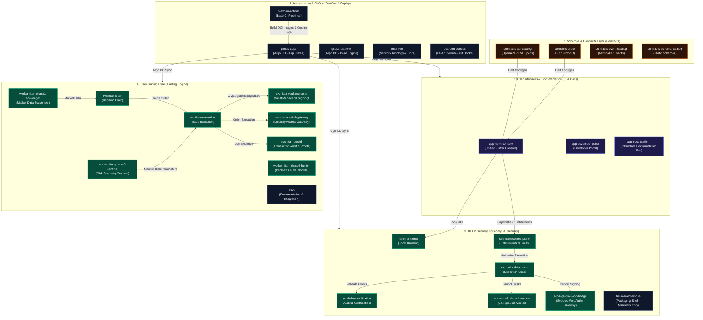

# Mindburn Labs, Inc.

**infrastructure for deterministic software execution.**

---

### What We Build

We build production-grade middleware for deterministic policy verification, high-integrity transaction execution, and strict cryptographic audit logging.

| Core Product | Description | Stack |
| :--- | :--- | :--- |
| **[HELM](https://github.com/Mindburn-Labs/helm-ai-kernel)** | The deterministic execution layer for the agent economy. Fail-closed policy enforcement, cryptographic receipts, replayable proofs. | Go · WASI · Ed25519 |

---

### 🗺️ Target Ecosystem Architecture

Diagram of the target repository interactions in A4 format for printing and rapid analysis (Phases 1–5):

---

### Polyrepo Ecosystem

### 👥 Team Ownership & CODEOWNERS Directory

To direct PR reviews, bug reports, and incident alerts, locate the specific responsible team using the matrix below:

| Operational Layer | Responsible GitHub Team | Primary Area | Lead CODEOWNER |
| :--- | :--- | :--- | :--- |
| **1. Product Cores** | `@Mindburn-Labs/helm-core-engineers` | HELM Kernel, ProofGraph | `@peycheff-com` |
| **2. PlatformOps & Infra** | `@Mindburn-Labs/platformops-leads` | CI, GitOps, Terraform, K8s | `@eipp` |
| **3. Agent Substrates** | `@Mindburn-Labs/agent-engineers` | Sandbox, Control Plane, MCP | `@mindburnlabs` |
| **4. Contracts & SDKs** | `@Mindburn-Labs/interface-managers` | OpenAPI, AsyncAPI, SDK codegen | `@peycheff-com` |
| **5. Decoupled Services** | `@Mindburn-Labs/services-developers` | State services, workers, NATS | `@mindburnlabs` |
| **6. User Interfaces** | `@Mindburn-Labs/console-frontend-devs` | Flutter Console, Admin Portal | `@peycheff-com` |

Mindburn Labs has successfully completed and fully synchronized its layered polyrepo architecture. Every decoupled component is independently versioned, secure, and production-ready, mapped across seven operational layers:

#### 🌐 1. Product Cores & Transition Shells
*   [`helm-ai-kernel`](https://github.com/Mindburn-Labs/helm-ai-kernel) [🌐 Public] — The open-source Go core, protocols, SDKs, and ProofGraph engine.
*   [`pilot`](https://github.com/Mindburn-Labs/pilot) [🌐 Public] — Open-source autonomous founder operating system.
*   [`homebrew-tap`](https://github.com/Mindburn-Labs/homebrew-tap) [🌐 Public] — Homebrew tap distribution for Mindburn CLI tools.
*   [`helm-ai-enterprise`](https://github.com/Mindburn-Labs/helm-ai-enterprise) [🔒 Private] — Commercial overlays, certified enterprise connectors, and enclaves.
*   [`titan`](https://github.com/Mindburn-Labs/titan) [🔒 Private] — Titan Trading Core, bio-mimetic execution engine.
*   [`orggenome-compiler`](https://github.com/Mindburn-Labs/orggenome-compiler) [🔒 Private] — GPU cluster compilers for organizational multi-agent genomes.
*   [`mindburn`](https://github.com/Mindburn-Labs/mindburn) [🔒 Private] — Core corporate platform and website.

#### ⚙️ 2. PlatformOps & Infrastructure
*   [`platform-actions`](https://github.com/Mindburn-Labs/platform-actions) — Shared GitHub Actions pipelines and reusable workflow definitions.
*   [`platform-policies`](https://github.com/Mindburn-Labs/platform-policies) — Declarative OPA/Kyverno access constraints and compliance rules.
*   [`platform-templates`](https://github.com/Mindburn-Labs/platform-templates) — Golden path repository templates and CLI scaffolding tools.
*   [`platform-observability`](https://github.com/Mindburn-Labs/platform-observability) — Central OTel telemetry collectors, dashboard templates, and SLO alerts.
*   [`platform-terraform-modules`](https://github.com/Mindburn-Labs/platform-terraform-modules) — Multi-cloud infrastructure resources (DigitalOcean, Cloudflare).
*   [`infra-live`](https://github.com/Mindburn-Labs/infra-live) — Multi-environment infrastructure-as-code configurations.
*   [`infra-networking`](https://github.com/Mindburn-Labs/infra-networking) — Zero Trust Network configuration and edge gateways.
*   [`infra-clusters`](https://github.com/Mindburn-Labs/infra-clusters) — Kubernetes cluster definitions and node group layouts.
*   [`gitops-platform`](https://github.com/Mindburn-Labs/gitops-platform) — Argo CD base controllers and system plugins.
*   [`gitops-apps`](https://github.com/Mindburn-Labs/gitops-apps) — Continuous delivery desired-state values and OCI image digests.

#### 🤖 3. Agent Substrate Layer
*   [`platform-agent-substrate`](https://github.com/Mindburn-Labs/platform-agent-substrate) — Ephemeral worker supervisor and credential exchange bridge.
*   [`platform-agent-capabilities`](https://github.com/Mindburn-Labs/platform-agent-capabilities) — Standardized execution skills, prompts, and regression evals.
*   [`platform-mcp-registry`](https://github.com/Mindburn-Labs/platform-mcp-registry) — Permissions-scoped Model Context Protocol tool indices.
*   [`svc-agent-control-plane`](https://github.com/Mindburn-Labs/svc-agent-control-plane) — Agent task broker and authorization routing gateway.
*   [`svc-agent-sandbox-runner`](https://github.com/Mindburn-Labs/svc-agent-sandbox-runner) — Sandboxed WASI runtime and container workspace orchestrator.
*   [`integration-agent-evals`](https://github.com/Mindburn-Labs/integration-agent-evals) — Regression suite executors for capability compliance audits.

#### 🔗 4. Contract Governance & SDKs
*   [`contracts-api-catalog`](https://github.com/Mindburn-Labs/contracts-api-catalog) — Central REST OpenAPI catalogs and breaking-change gates.
*   [`contracts-event-catalog`](https://github.com/Mindburn-Labs/contracts-event-catalog) — NATS AsyncAPI specs and JSON-schema backward-compatibility gates.
*   [`contracts-proto`](https://github.com/Mindburn-Labs/contracts-proto) — Aggregated Protobuf registry and Buf breaking-change verifier.
*   [`contracts-schema-catalog`](https://github.com/Mindburn-Labs/contracts-schema-catalog) — Aggregator for non-API specs.
*   [`pkg-helm-client-go`](https://github.com/Mindburn-Labs/pkg-helm-client-go) — Stubs and types for Go integrations.
*   [`pkg-helm-client-ts`](https://github.com/Mindburn-Labs/pkg-helm-client-ts) — Autogenerated TypeScript SDK library.
*   [`pkg-helm-client-python`](https://github.com/Mindburn-Labs/pkg-helm-client-python) — Autogenerated Python client package.
*   [`pkg-titan-shared`](https://github.com/Mindburn-Labs/pkg-titan-shared) — Shared types, metrics, and models.

#### 🏛️ 5. Decoupled Services & Workers
*   [`svc-helm-control-plane`](https://github.com/Mindburn-Labs/svc-helm-control-plane) — Commercial authorization broker and metering engine.
*   [`svc-helm-data-plane`](https://github.com/Mindburn-Labs/svc-helm-data-plane) — High-throughput ledger, event router, and transactional gateway.
*   [`svc-helm-certification`](https://github.com/Mindburn-Labs/svc-helm-certification) — Sandbox and MCP tool conformance verifier.
*   [`worker-helm-launch-worker`](https://github.com/Mindburn-Labs/worker-helm-launch-worker) — Asynchronous worker for long-running sandboxed steps.
*   [`svc-high-risk-loop-bridge`](https://github.com/Mindburn-Labs/svc-high-risk-loop-bridge) — Compensating ledger bridge for manual operators.
*   [`svc-titan-brain`](https://github.com/Mindburn-Labs/svc-titan-brain) — Cognitive model coordinator and portfolio strategy selector.
*   [`svc-titan-execution`](https://github.com/Mindburn-Labs/svc-titan-execution) — Low-latency orders executor and position risk arbiter.
*   [`worker-titan-phase1-scavenger`](https://github.com/Mindburn-Labs/worker-titan-phase1-scavenger) — Phase 1 scavenger and scrap pipeline.
*   ... _and other decoupled microservices for Titan and Pilot operations._

#### 💻 6. Frontends & Portals
*   [`app-docs-platform`](https://github.com/Mindburn-Labs/app-docs-platform) — Central documentation crawler and validation platform.
*   [`app-developer-portal`](https://github.com/Mindburn-Labs/app-developer-portal) — Backstage developer portal mapping ownership, contracts, and OCI logs.
*   [`app-mindburn-admin`](https://github.com/Mindburn-Labs/app-mindburn-admin) — Operating dashboard and ground truth visual ledger.

---

### Secure SDLC Invariants
All organization repositories strictly operate under a **zero-trust security architecture**:
*   **Zero Static Keys:** Long-lived cloud tokens and static credentials are mathematically forbidden; GitHub Actions pipelines utilize passwordless **OIDC federation** for DigitalOcean and Cloudflare.
*   **Vulnerability Gates:** Monthly Dependabot/Renovate dependency updates and automatic Push Protection are enabled.

---

